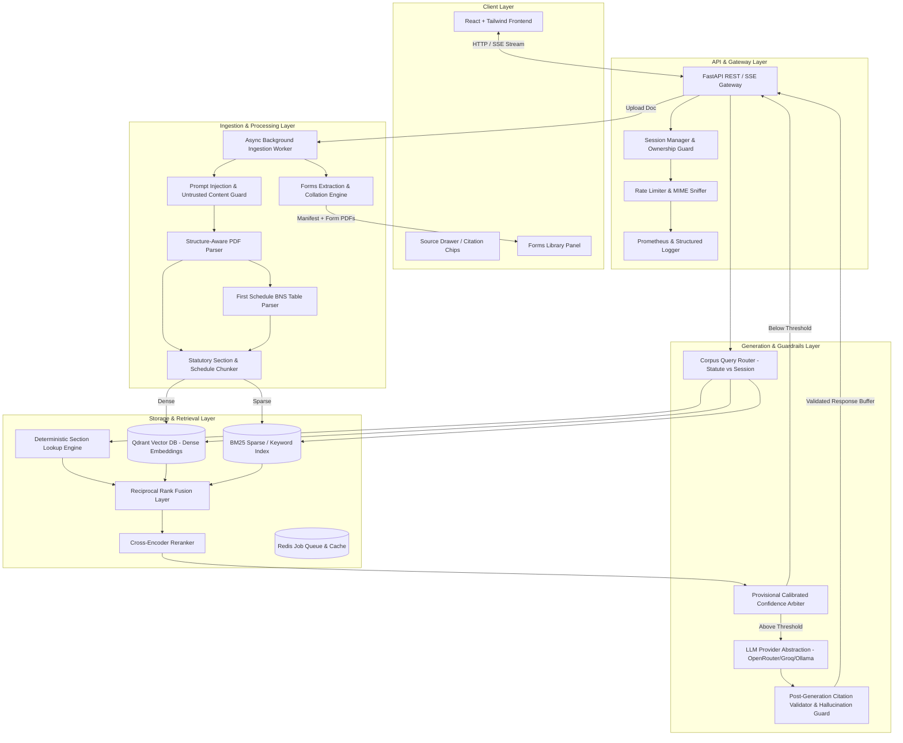
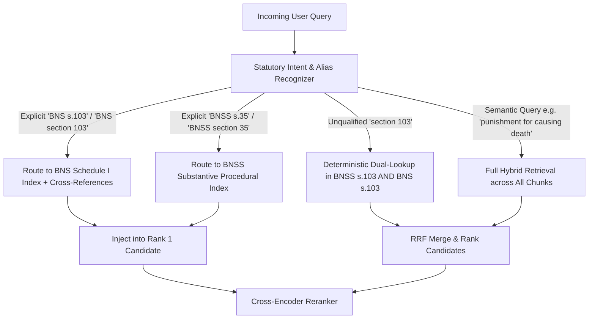
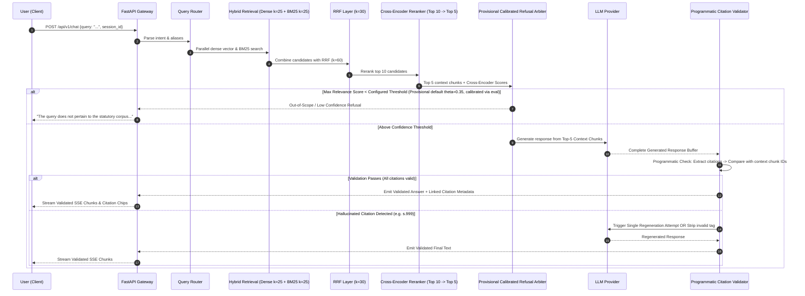
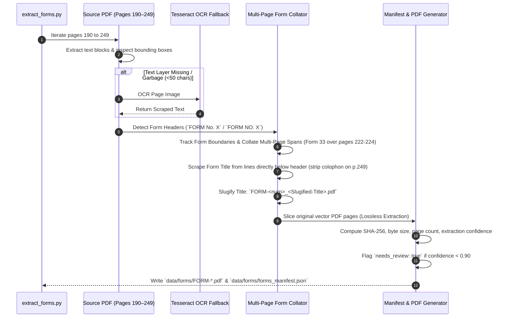
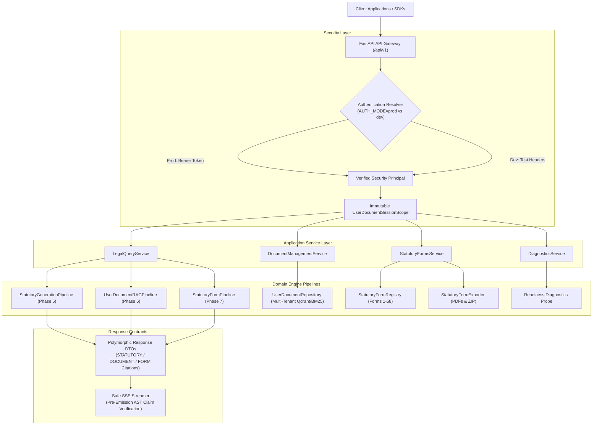

# Architecture & System Design — Nyaya Legal RAG

Nyaya Legal RAG is an enterprise-grade, structure-aware statutory retrieval-augmented generation system and legal forms extraction engine designed for the statutory volume containing the Bharatiya Nagarik Suraksha Sanhita, 2023 (BNSS) and the Bharatiya Nyaya Sanhita, 2023 (BNS) First Schedule offences classification.

---

## 1. High-Level System Architecture



---

## 2. Component Responsibilities

| Component | Technology | Primary Responsibilities |
| :--- | :--- | :--- |
| **Frontend UI** | React 18, Vite, Tailwind CSS, Lucide Icons | Multi-turn chat, validated SSE streaming, interactive citation chips with slide-out statutory source drawer, drag-and-drop document upload with real-time stage progress (`parse` $\rightarrow$ `chunk` $\rightarrow$ `embed` $\rightarrow$ `ready`), forms search and preview. |
| **API Gateway** | FastAPI, Pydantic v2, Uvicorn | Request routing, SSE streaming endpoints, session validation (`X-Session-ID`), document CRUD with vector purge, Prometheus metric instrumentation, OpenAPI generation. |
| **PDF Ingestion Engine** | PyPDF, PyMuPDF / pdfplumber | Clean text extraction, Gazette running header/footer filtering (`THE GAZETTE OF INDIA EXTRAORDINARY`, lines of underscores), marginal notes and side-heading extraction, hyphenation de-wrapping, and **The First Schedule (Pages 158–189) BNS Offence Table parser**. |
| **Statutory Chunker** | Custom AST / Hierarchy Chunker | Treating the **Section** as the atomic unit. Splitting long sections only at strict subsection/clause boundaries (`(1)`, `(a)`, `(i)`). Guaranteeing Provisos, Exceptions, Explanations, and Illustrations remain attached to their parent section. Structures substantive BNSS sections (1–531) and substantive BNS offence schedules (1–356). |
| **Forms Extraction Pipeline** | PyMuPDF, Python PDF, OCR Fallback (Tesseract) | Detecting form start headers on pages 190–249, collating multi-page forms (e.g., Form 33 over pages 222–224), scraping titles from below form headers, deterministic naming (`FORM-<num>_<slug>.pdf`), generating `forms_manifest.json` with SHA-256, confidence scores, and `needs_review` flags. |
| **Hybrid Vector Store** | Qdrant, Rank-BM25 | Dense vector indexing with `BAAI/bge-base-en-v1.5`, sparse lexical indexing via BM25, payload metadata filtering by act, chapter, section, and session ID. Pre-computed disk caching for instantaneous startup. |
| **Query Routing & Fusion** | Python, NumPy | Deterministic section intent extraction (`BNS s.103` / `BNSS s.35`), Reciprocal Rank Fusion ($k=60$) combining dense ($k=25$) and sparse ($k=25$) ranks, cross-encoder reranking (`cross-encoder/ms-marco-MiniLM-L-6-v2`), confidence scoring and refusal arbitration. |
| **LLM Provider Abstraction** | Custom Protocol / Adapter | Unified streaming and non-streaming interface supporting OpenRouter, Groq, Ollama (local/offline evaluation), OpenAI, and Gemini via configuration. |
| **Citation Guard & Security** | Regex AST & Validator | Programmatic code guard that buffers generation, extracts all `[Act s.X(Y)]` citation chips (supporting both `BNS` and `BNSS`), verifies that cited sections exist in the retrieved context, and blocks/regenerates hallucinated citations before client delivery. |
| **Telemetry & Observability** | Prometheus Client | Discrete latency instrumentation tracking `retrieval_duration_seconds` and `generation_duration_seconds` histograms separately for exact p50/p95 breakdown, plus query cost calculator. |
| **Async Task Worker** | `arq` / Redis (or FastAPI background workers + persistent job DB) | Offloading 60+ page PDF parsing, chunking, and embedding from the web request loop, updating real-time job status. |

---

## 3. Data Model & Metadata Schema

### Statutory Identity vs Legal Act Represented
To preserve statutory integrity without silent renaming:
- **Source Document / Corpus**: `BNS bare act 2023.pdf` (249-page official Gazette volume).
- **Substantive Sections (Pages 1–157)**: Enacted text of `Bharatiya Nagarik Suraksha Sanhita, 2023` (Act 46 of 2023), representing the procedural code (`act_short: "BNSS"`).
- **The First Schedule (Pages 158–189)**: Authoritative classification table of offences under the `Bharatiya Nyaya Sanhita, 2023`, representing substantive penal law (`act_short: "BNS"`).

### Schema Definition for Substantive Procedural Chunks (BNSS)
```json
{
  "act": "Bharatiya Nagarik Suraksha Sanhita, 2023",
  "act_short": "BNSS",
  "chapter": "V",
  "chapter_title": "ARREST OF PERSONS",
  "section_number": "35",
  "section_title": "When police may arrest without warrant",
  "subsection": "(1)",
  "clause": "(a)",
  "chunk_type": "substantive_section",
  "text": "35. (1) Any police officer may without an order from a Magistrate and without a warrant, arrest any person—\n(a) who commits, in the presence of a police officer, a cognizable offence;\nProvided that in all cases where the arrest of a person is not required under the provisions of this sub-section, the police officer shall record the reasons in writing for not making the arrest.",
  "has_illustration": false,
  "has_proviso": true,
  "has_exception": false,
  "has_explanation": false,
  "page_start": 13,
  "page_end": 14,
  "chunk_id": "bnss-s35-001",
  "references": ["section 84", "section 107"],
  "source_uri": "BNS bare act 2023.pdf",
  "ingested_at": "2026-08-29T19:45:00Z"
}
```

### Schema Definition for First Schedule Penal Chunks (BNS)
```json
{
  "act": "Bharatiya Nyaya Sanhita, 2023",
  "act_short": "BNS",
  "chapter": "SCHEDULE_I",
  "chapter_title": "THE FIRST SCHEDULE - CLASSIFICATION OF OFFENCES",
  "section_number": "105",
  "section_title": "Culpable homicide not amounting to murder",
  "subsection": null,
  "clause": null,
  "chunk_type": "schedule_entry",
  "offence_name": "Culpable homicide not amounting to murder",
  "punishment": "Imprisonment for life, or imprisonment for 10 years and fine",
  "cognizable_status": "Cognizable",
  "bailable_status": "Non-bailable",
  "triable_court": "Court of Session",
  "text": "BNS Section 105: Culpable homicide not amounting to murder.\nOffence: Culpable homicide not amounting to murder.\nPunishment: Imprisonment for life, or imprisonment for 10 years and fine.\nCognizability: Cognizable | Bailable: Non-bailable | Court: Court of Session.",
  "has_illustration": false,
  "has_proviso": false,
  "has_exception": false,
  "has_explanation": false,
  "page_start": 164,
  "page_end": 164,
  "chunk_id": "bns-sched1-s105",
  "references": [],
  "source_uri": "BNS bare act 2023.pdf",
  "ingested_at": "2026-08-29T19:45:00Z"
}
```

---

## 4. Query Routing & Alias Resolution



1. **Explicit BNS Query** (*"What is the punishment under BNS section 105?"*):
   - Targets chunks where `act_short == "BNS"` in First Schedule table.
2. **Explicit BNSS Query** (*"What is the procedure under BNSS section 35?"*):
   - Targets chunks where `act_short == "BNSS"` in substantive chapters.
3. **Unqualified Section Query** (*"What is section 103?"*):
   - Deterministically fetches both BNSS Section 103 (recording of confessions/statements) and BNS Section 103 (murder entry in Schedule 1), letting the cross-encoder and user prompt context establish final rank.

---

## 5. Retrieval & Generation Pipeline



---

## 6. Citation Validation Architecture: Zero Unvalidated Claims

To guarantee that **unvalidated legal claims are never exposed to the user**:
1. **Server-Side Generation Buffering**:
   - The LLM generation is received and held in a server-side buffer until completion.
2. **Programmatic AST Verification**:
   - Regex extractor: `r'\[(BNS|BNSS)\s+s\.(\d+[A-Z]?)(?:\(([^)]+)\))?\]'`.
   - The validator compares every cited section against the list of `section_number` values present in the 5 retrieved context chunks.
3. **Regeneration / Refusal Guard**:
   - If the model cites a hallucinated section (e.g. `[BNS s.999]`), the system halts emission, initiates a strict single regeneration attempt with a negative penalty prompt, and if validation fails a second time, falls back to a safe refusal.
4. **Validated Streaming Emission**:
   - Once validated, the response is streamed to the client via Server-Sent Events (SSE) along with rich chunk metadata for interactive source chips.

---

## 7. Forms Extraction & Collation Pipeline (Pages 190–249)



---

## 8. Evaluation-First Harness & Telemetry

```mermaid
graph LR
    subgraph Golden Dataset
        GS[eval/golden_set.jsonl]
        T1[15 Lookup Queries]
        T2[10 Reasoning Queries]
        T3[5 Must-Refuse Queries]
    end

    subgraph Benchmarking Configurations
        C1[Config A: Dense Only - BGE-base]
        C2[Config B: Hybrid - Dense + BM25 + RRF]
        C3[Config C: Hybrid + Cross-Encoder Reranker]
    end

    subgraph Evaluation Harness
        RUN[eval/run_eval.py]
    end

    subgraph Metrics Output
        M1[Recall@5 & Recall@10]
        M2[Mean Reciprocal Rank - MRR]
        M3[Citation Accuracy %]
        M4[Refusal Precision %]
        M5[Retrieval p50/p95 Latency]
        M6[Generation p50/p95 Latency]
        M7[Estimated Cost per Query USD]
    end

    GS --> RUN
    C1 & C2 & C3 --> RUN
    RUN --> M1 & M2 & M3 & M4 & M5 & M6 & M7
```

---

## 9. Second Schedule Statutory Forms Architecture (Phase 7)

Phase 7 provides authoritative, deterministic extraction and structured modeling of all 58 statutory forms framed under Section 522 of the Bharatiya Nagarik Suraksha Sanhita, 2023 (BNSS) located on Pages 190–249 of the Gazette enactment (`BNS bare act 2023.pdf`).

```mermaid
graph TD
    Query["User Form Query<br>('Form 1', 'Section 35(3)', 'Attachment warrant')"] --> Router{"Deterministic Form Identifier"}
    
    Router -->|Form Number / Section / Exact Title| ExactMatch["Multi-Index Registry Match"]
    Router -->|Fuzzy / Natural Language| FuzzyMatch["Token-Set Alias Matcher"]
    
    ExactMatch & FuzzyMatch --> Registry["StatutoryFormRegistry<br>(58 Pre-Indexed Canonical Forms)"]
    
    Registry -->|Match Found| Renderer["Deterministic Markdown / Text Renderer<br>(Zero LLM Cost)"]
    Registry -->|Multiple Overlaps| Ambiguous["Ambiguity Disambiguation<br>(Return Candidate List)"]
    Registry -->|Out of Range (Form 99)| Refusal["Clean Refusal<br>(Form Not Found / Inaccessible)"]
    
    Renderer --> Output["Verified Form Presentation<br>[BNSS Second Schedule, Form X]"]
    Renderer -.->|Optional Conversational QA| LLM["Grounded LLM Explainer<br>+ AST Citation Validator"]
    LLM -.-> Output
```

### Key Components
1. **`SecondScheduleParser`**: Dynamically identifies `FORM No. 1` through `FORM No. 58` across pages 190–249 without rigid hardcoded page offsets. Cleans Gazette publication boilerplate and running headers. Parses multi-page forms (Form 33 spanning pages 222–224) seamlessly into typed `StatutoryForm` models.
2. **Programmatic Invariants**: Enforces that exactly 58 forms exist, numbering is contiguous from 1 to 58, Form 1 starts on page 190, Form 58 is on page 249, Form 33 spans pages 222–224, and no form raw text is empty.
3. **`StatutoryFormRegistry`**: Thread-safe in-memory registry indexing forms by Form Number, Form ID (`BNSS_FORM_01`), Applicable Statutory Sections (e.g. `35(3)` $\rightarrow$ Form 1, `63` $\rightarrow$ Form 2, `83` $\rightarrow$ Form 4), and Normalized Titles.
4. **`DeterministicFormIdentifier`**: Zero-LLM sub-millisecond lookup engine resolving numeric, section-based, exact title, and token-set fuzzy queries. Resolves ambiguous queries to structured candidate lists and cleanly refuses non-existent forms (e.g. Form 99).
5. **`StatutoryFormExporter`**: Extracts vector-grade discrete PDF files for all 58 forms (`data/forms/FORM-<num>_<slug>.pdf`), computes SHA-256 hashes and byte sizes, calculates deterministic extraction confidence scores, and emits `data/forms/forms_manifest.json`.
6. **`DeterministicFormRenderer`**: Generates publication-grade Markdown and plain-text output directly from typed form models with zero LLM dependency.
7. **`FormCitationValidator`**: AST citation validator verifying canonical citation tags `[BNSS Second Schedule, Form X]`, confirming form existence ($1 \le X \le 58$) and context retrieval grounding.

---

## 10. API & Application Gateway Architecture (Phase 8 & Part B)

Phase 8 exposes the full spectrum of statutory retrieval, grounded reasoning, multi-tenant document isolation, and statutory form extraction capabilities via a hardened **FastAPI REST & SSE Gateway**.



### Core Endpoints
1. **`POST /api/v1/query`**: Unified grounded query execution across Statutory, User Document, Combined, or Statutory Form engines with AST citation verification.
2. **`POST /api/v1/query/stream`**: Server-Sent Events (SSE) safe streaming with buffered pre-emission AST verification (no unvalidated legal claims streamed).
3. **`POST /api/v1/documents`**: Multipart PDF upload ($\le 25\text{MB}$, magic-byte header validation, isolated multi-tenant chunking, embedding, and synchronous indexing).
4. **`GET /api/v1/documents`**: Scoped document listing for authenticated principal.
5. **`GET /api/v1/documents/{document_id}`**: Scoped document metadata retrieval (uniform 404 anti-enumeration on missing/unowned documents).
6. **`DELETE /api/v1/documents/{document_id}`**: Scoped document purging from vectors and BM25 index (uniform 404).
7. **`GET /api/v1/forms`**: List all 58 statutory forms with scraped titles, sections, page ranges, byte sizes, SHA-256 hashes, confidence scores, and download URLs.
8. **`GET /api/v1/forms/search?q=<query>`**: Deterministic query parameter search for statutory forms.
9. **`POST /api/v1/forms/lookup`**: Sub-millisecond deterministic form lookup by number, section, title, or fuzzy query (POST).
10. **`GET /api/v1/forms/{id_or_number}/download`**: Download individual form as a vector/text PDF file.
11. **`GET /api/v1/forms/download-all`**: Bulk download all 58 statutory form PDFs as a single ZIP archive.
12. **`GET /api/v1/forms/{id_or_number}`**: Direct Second Schedule statutory form JSON metadata retrieval.
13. **`GET /api/v1/health`**: Lightweight process liveness probe ($< 1\text{ms}$).
14. **`GET /api/v1/ready`**: Deep dependency readiness diagnostic probe inspecting Qdrant, embeddings, forms registry, and LLM configuration.
